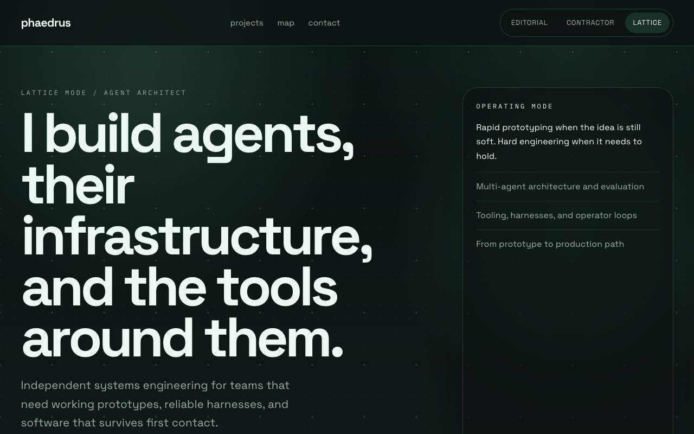
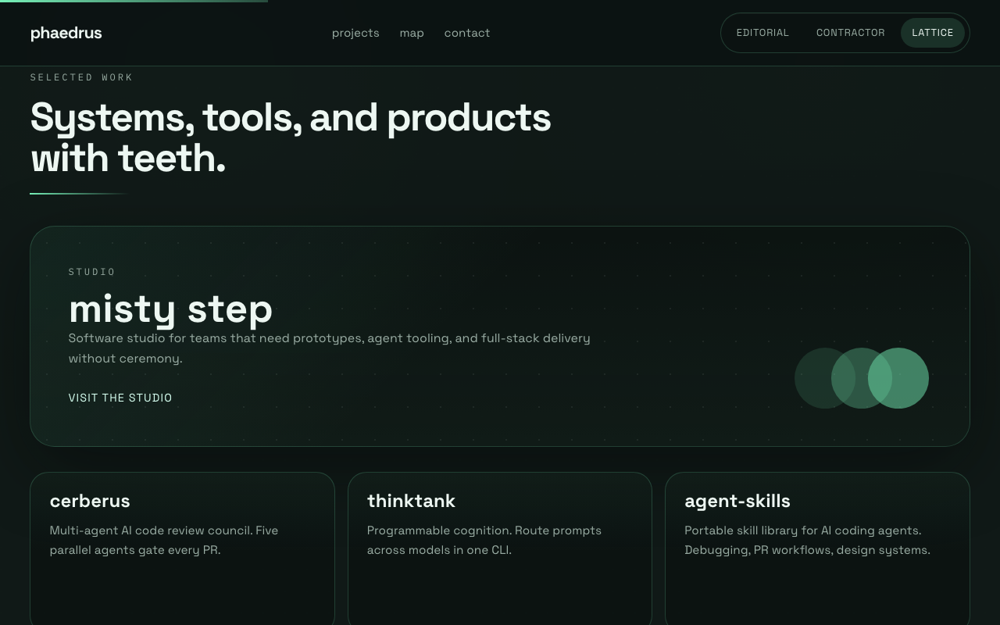
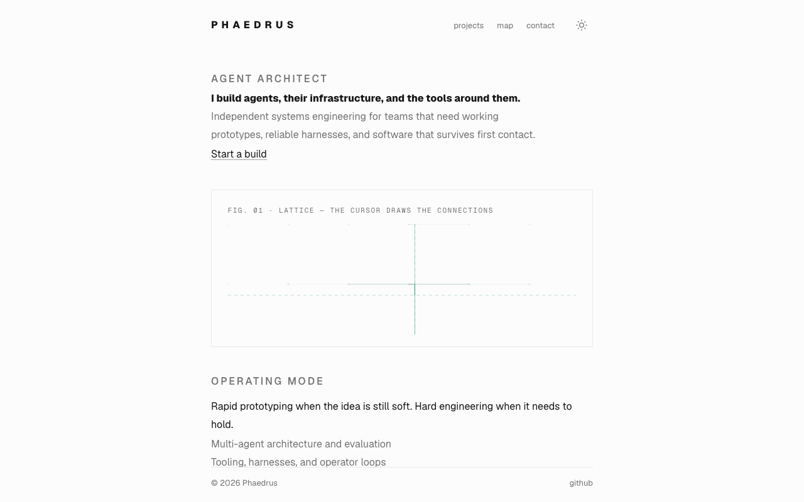
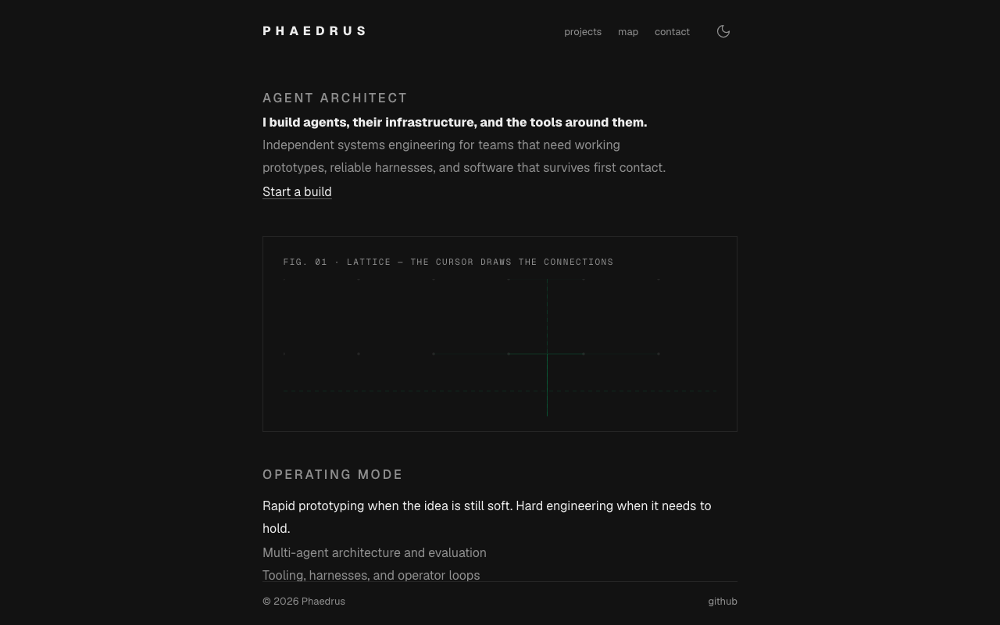
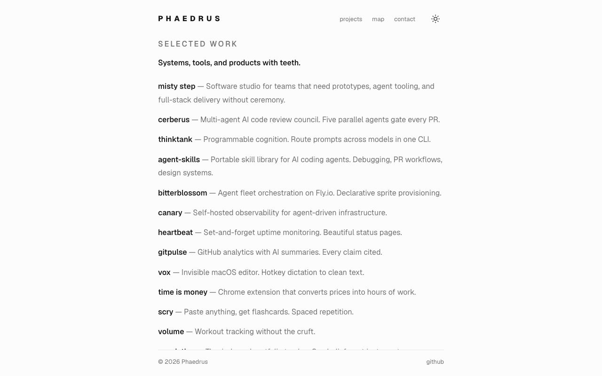
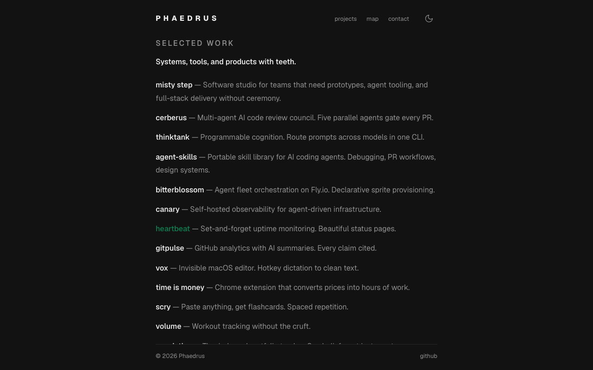

# Re-ground vanity on @misty-step/aesthetic

## The argument

vanity carried three hand-rolled themes — Lattice (dark mint, the
default), Editorial (serif), Contractor — wired through `data-theme`,
a 131-line `themes.json` of per-theme copy, a 530-line `script.js`,
and a 1,033-line `styles.css`: three font stacks, a `clamp()` type
scale, per-theme token sets, reveal-on-scroll choreography, a scroll
progress bar, and a glowing canvas.

That entire surface collapses into the design system plus **one
steering block**:

```css
:root {
  --ae-accent: #0e7a4d;
  --ae-accent-dark: #77f0b8;
}
```

The mint signature — already canonical as vanity's worked example in
the kit's `docs/ADOPTING.md` — is the only color this repo still
defines. Light and dark come from the system as equals (OS default,
`.ae-mode` toggle, boot-before-paint, one 700ms breath). Identity
comes from ink, hairlines, registers, and the one element that
survived with its character intact: **the lattice canvas**, the
page's one generative element. It now reads `--ae-line` (nodes) and
`--ae-accent` (connections) from the live computed style at draw
time, so it follows the mode with no wiring; its glow is gone —
nothing glows here.

Repo-owned code: 1,850 lines hand-rolled → 402 lines
(`index.html` 199 · `site.css` 77 · `lattice.js` 126), plus the kit's
behavior file vendored verbatim (`aesthetic.recipes.js`, 352).

## Composition: one document, not views

The page is a single scrolling document (`.ae-stage-scroll`), not
nav-swapped views. A portfolio is one document read top to bottom;
hiding the work behind view swaps adds routing for no payoff. The law
holds either way — the chrome (bar, footer) never moves, the document
scrolls *inside* the stage — and the system's own homepage sets the
precedent. The bar's chrome links (`projects · map · contact`) cut
straight to their sections: a simple cut, no smooth-scroll theater.

Hierarchy is registers, not scale: the name is 800-spaced in the bar,
the argument sentence is the page's one loud thing, projects are
`.ae-row-link` rows (550 name, muted blurb, whole row is the link),
the capability map is term-over-definition, the thesis is a
hairline-set quote, and the lattice sits in a numbered plate
(`FIG. 01`, 11px mono caption) like a figure in an engineering manual.

## What was deleted · what survived

| Deleted | Survived |
| --- | --- |
| Theme picker UI + `data-theme` glue | Every word of the default (Lattice-voice) copy |
| `themes.json` (+ Editorial/Contractor copy variants) | All 18 projects + the featured studio, as static rows |
| `styles.css` (3 themes, clamp() scale, 3 font stacks) | The lattice canvas — recolored to the system's tokens |
| `script.js` (theme state, copy swapping, reveal/scroll FX) | `projects`/`map`/`contact` nav, now chrome links |
| `projects.json` + fetch + loading state (rows are markup now) | The mint signature, as the steering block |
| Scroll progress bar, reveal-on-scroll, hero char animation (ambient motion) | |
| Canvas glow (nothing glows), rounded cards, decorative shadows | |
| Interim one-screen page from this branch (colophon typewriter, `quotes.js`) | |

The accent is spent exactly twice: the lattice connections
(generative) and the contact link. Everything else is ink.

## Before / after

| | |
| --- | --- |
|  |  |
|  |  |
|  |  |

## Verification

Served the worktree and walked both modes through the real `.ae-mode`
toggle with Playwright (chromium, 1280×800). The pinned
`aesthetic@v2.5.0` CDN URL was not live at verification time, so the
request was intercepted and fulfilled with the local `aesthetic.css`
at the kit's HEAD (the v2.5.0 candidate) — the committed markup was
exercised exactly as written.

```sh
python3 -m http.server 8462   # serve the repo root
# walk: / (light) → toggle → dark → /#projects (dark, boot-pinned) → toggle → light
```

Results (full sweep over every element, both modes):

- **No console errors**, page errors, or failed requests.
- **No element computes a font size over 16px** (13px chrome register,
  11px mono plate caption are the kit's own registers).
- **`border-radius` is 0 everywhere.**
- **The canvas follows the mode**: node pixel `#e9e9e9` in light →
  `#262626` in dark (`--ae-line`, read at draw time); connections in
  the mint accent.
- Mode persists (`ae-mode` in localStorage) and boots before paint on
  fresh navigation; `<html>` class walks `'' → dark → light`.
- Exactly one static accent instance (`.ae-accent` on the contact
  link).

Re-check after the tag is live (no interception needed):

```sh
npx playwright screenshot --browser chromium --viewport-size 1280,800 \
  --wait-for-timeout 1500 http://localhost:8462/ /tmp/vanity-check.png
```

and in the console:

```js
[...document.querySelectorAll('*')].filter(e => parseFloat(getComputedStyle(e).fontSize) > 16 || getComputedStyle(e).borderRadius !== '0px')
```

## Residuals

- **`v2.5.0` is not tagged yet.** The pin and the vendored
  `aesthetic.recipes.js` reflect the v2.5.0 candidate at the kit's
  HEAD. If the tag lands with further changes, refresh the vendored
  recipes and re-walk both modes (commands above).
- **Contact email** kept verbatim from master
  (`phaedrus.raznikov@pm.me`); the interim branch page used
  `phraznikov@gmail.com`. Operator to confirm which is canonical.
- The Editorial/Contractor **copy variants** died with the theme
  system; only the default voice survives. The `Lattice mode /`
  kicker prefix (which named the deleted theme) became
  `AGENT ARCHITECT`.
- This branch's earlier commits hold the interim one-screen page
  (colophon typewriter); this recomposition supersedes it, and
  history preserves it.
